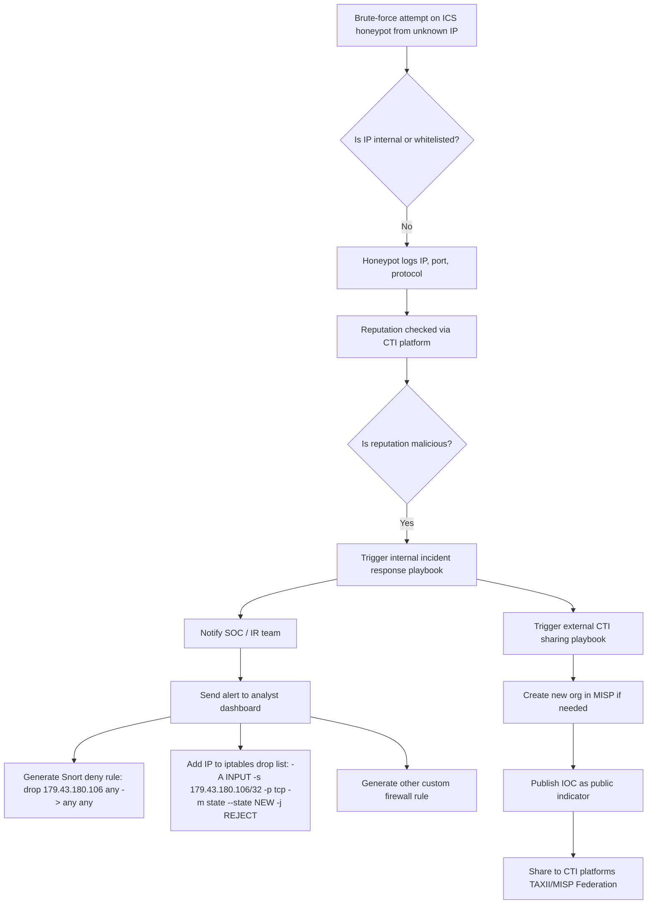
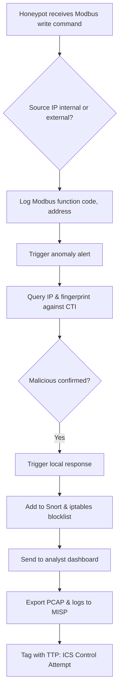
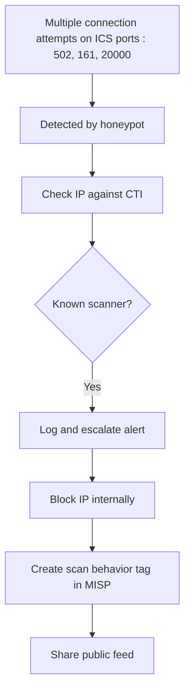
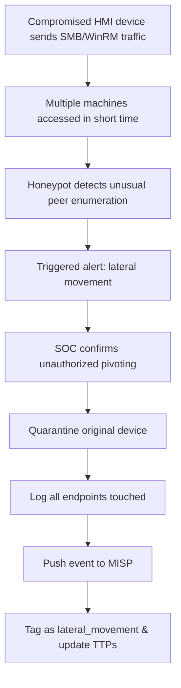
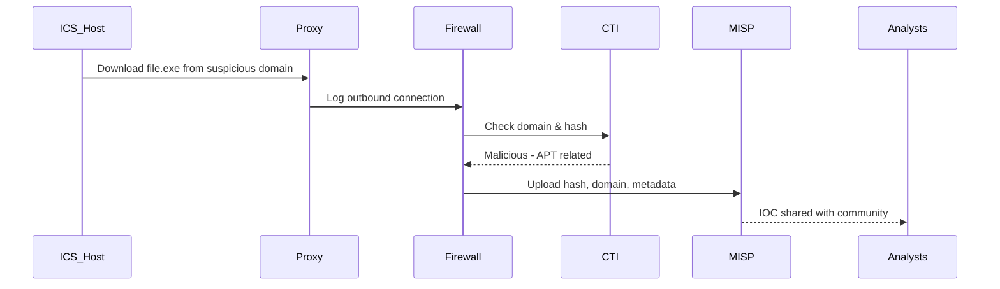

# ICS Honeypot Brute-force Attack & CTI Response Flow

## Attack Scenario: Brute-force against ICS Honeypot




> **Generate SNORT detection alerts:**
- Detect repeated SSH connection attempts :
  ```
  alert tcp $EXTERNAL_NET any -> $HOME_NET 22 (msg:"ICS Brute-force SSH Login Attempt"; flow:to_server,established; detection_filter:track by_src, count 5, seconds 60; sid:1001001; rev:1;)
  ```
- Detect VNC access attempts to SCADA HMI :
  ```
  alert tcp $EXTERNAL_NET any -> $HOME_NET 5900 (msg:"ICS Brute-force VNC Access to HMI"; flow:to_server,established; detection_filter:track by_src, count 5, seconds 60; sid:1001002; rev:1;)
  ```
- General ICS HMI web login attempts  :
  ```
  alert tcp $EXTERNAL_NET any -> $HOME_NET 80 (msg:"ICS Web Login Brute-force"; flow:to_server,established; content:"Authorization: Basic"; nocase; http_header; detection_filter:track by_src, count 10, seconds 60; sid:1001003; rev:1;)
  ```

```mermaid
sequenceDiagram
  participant Attacker
  participant Honeypot
  participant CTI
  participant SOC
  participant Firewall
  participant Snort
  participant MISP

  Attacker->>Honeypot: Brute-force login attempts (SSH/Modbus)
  Honeypot->>CTI: Query IP reputation
  CTI-->>Honeypot: Returns "malicious"
  Honeypot->>SOC: Trigger alert with IP, timestamp
  SOC->>Snort: Add dynamic deny rule
  SOC->>Firewall: Append DROP rule in iptables
  SOC->>MISP: Push IP as new IOC
  MISP->>CTI: Share indicator via public feed
  SOC->>Snort: Generate SNORT detection alerts
  ```


```mermaid
graph TB
  subgraph Detection
    D1[Unusual login attempts on ICS interface]
    D2[IP not recognized in asset inventory]
    D3[Reputation check = blacklisted]
  end

  subgraph Internal_Response
    R1[Create Snort drop rule]
    R2[Block IP in iptables]
    R3[Alert SOC analyst]
    R4[Enrich IOC with honeypot logs]
    R5[Generate SNORT detection alerts]
  end

  subgraph External_Response
    E1[Login to MISP]
    E2[Create new event: ICS brute-force]
    E3[Attach IP, port, timestamp]
    E4[Mark TLP:WHITE and share publicly]
    E5[Enable MISP Federation or TAXII push]
  end

  D1 --> D2 --> D3 --> R3 --> R1 --> R2 --> R4 --> R5  --> E1 --> E2 --> E3 --> E4 --> E5
```

### Attack Scenario: Unauthorized Modbus Write Detected




## 🧠 3. Suspicious IP Scanning Multiple ICS Ports


## 🧠 4. Lateral Movement Detected in ICS Subnet



## 🧠 5. Download of Suspicious ICS Payload from Internet




